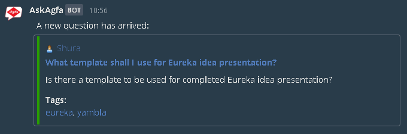
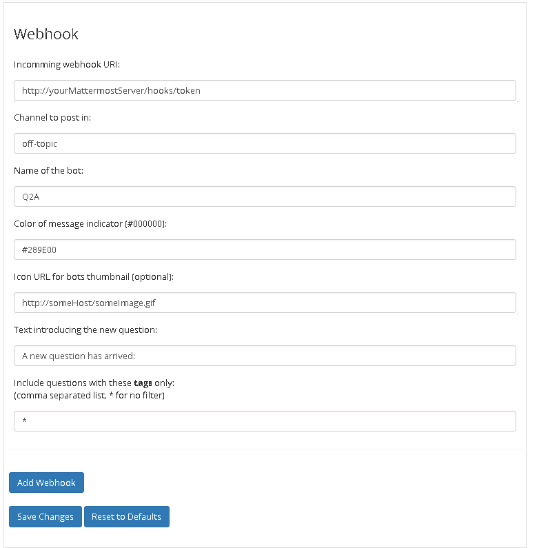

# qa-mattermost-notifications
Enable Mattermost notifications for Q2A v0.4
This plug-in was derived from the HipChat plug-in for Q2A by jhubert (https://github.com/jhubert/qa-hipchat-notifications).

## Current features

- you add several web hooks to post into different channels.
- for each web hook you can filter what tags or categories you want to be notified of. * means all (no filter)
- Post includes author (full name (Warnung)), title, text, tags and category
- Mattermost post links directly to the question
- tags and category are links to the page of questions with this tag/category
- Currently only new questions get posted to Mattermost

    
## Open topics
- Post to Mattermost if a question has been answered for the first time to indicate that you don't need to look at it anymore.
- Support special characters (like äöü) correctly. At the moment Mattermost is displaying them wrong.
